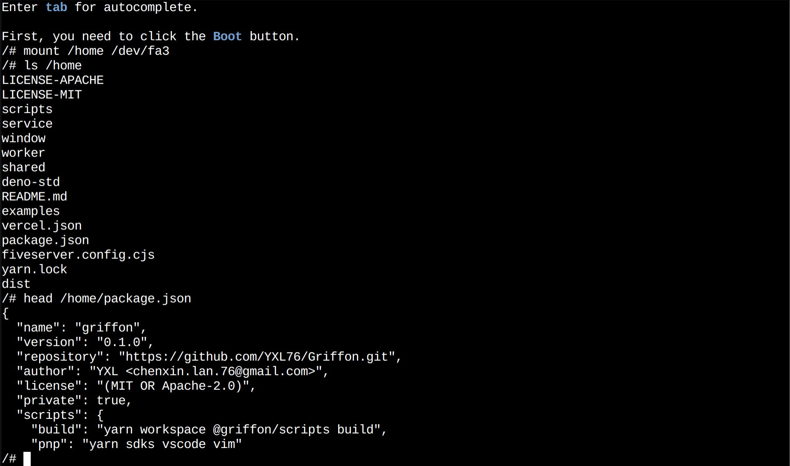

# Griffon

> Run Node.js/Deno natively in browser

Griffon is an operating system built on top of the browser. It has modules such as file system, process management, pipes, sockets, etc.

You can check the [Live Demo](https://griffon.vercel.app/)
